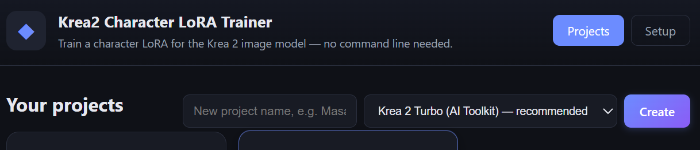
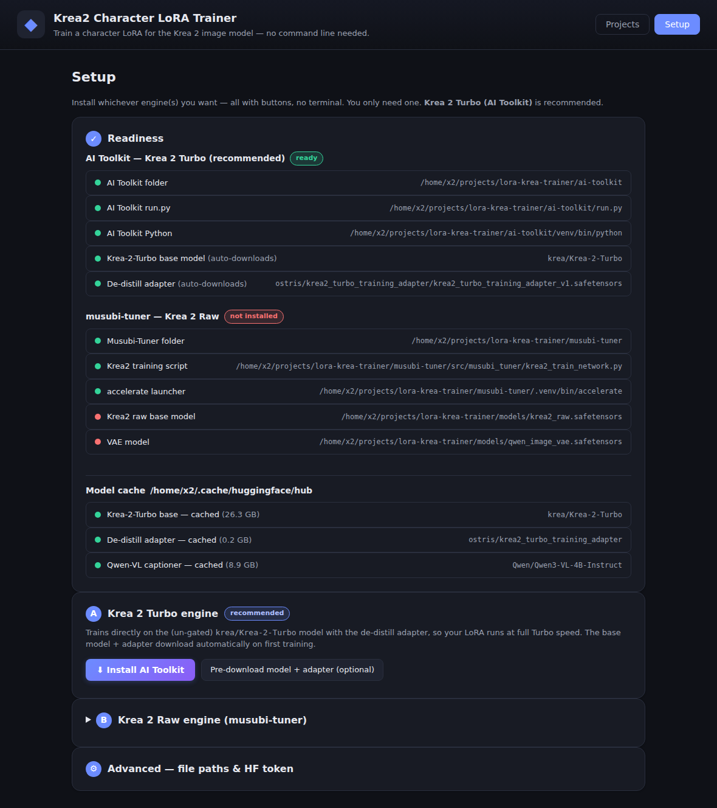
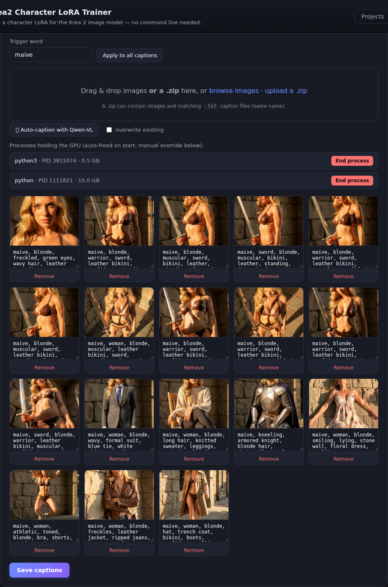
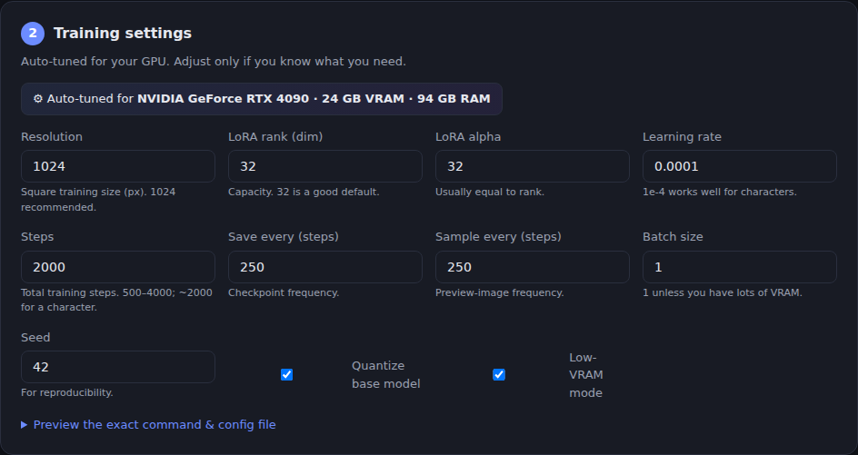
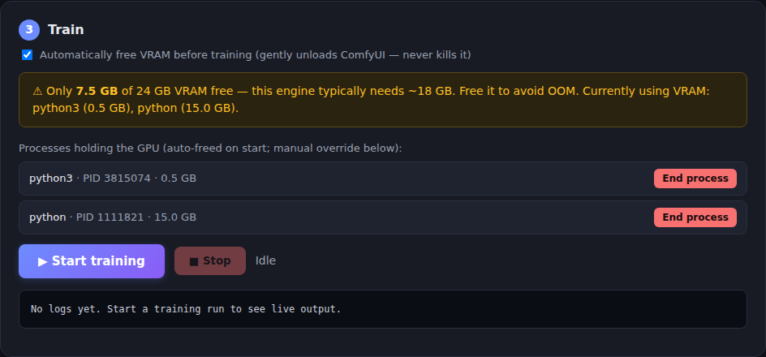
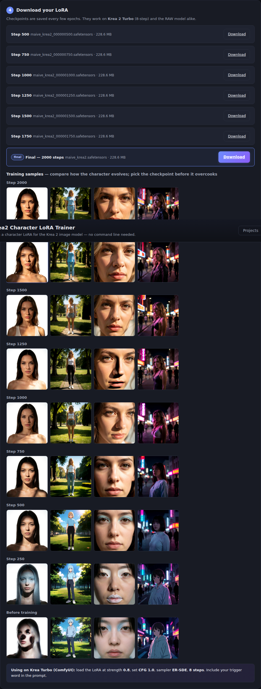

# Krea 2 Character LoRA Trainer

Train a **character LoRA for the Krea 2 image model** through a clean web UI —
no command line needed. Upload 10–20 images, auto-caption them, click **Start
training**, and download a Turbo-ready `.safetensors` LoRA.



---

## Highlights

- 🖥️ **No command line.** A double-click Windows installer + a browser UI. (Linux/macOS supported too.)
- ⚡ **Turbo-native.** Trains directly on the (un-gated) `krea/Krea-2-Turbo` with the
  [de-distill adapter](https://huggingface.co/ostris/krea2_turbo_training_adapter) so your
  LoRA runs at full 8-step Turbo speed. A second **Raw** engine (musubi-tuner) is optional.
- 🏷️ **One-click auto-captioning** with a small Qwen-VL model (4-bit, with CPU fallback).
- 🧠 **Hardware-aware.** Detects your VRAM/RAM and auto-tunes settings so training fits the card.
- 🧹 **Automatic VRAM management.** Gently unloads ComfyUI before training/captioning — no OOM, no killed apps.
- 🖼️ **Visual feedback.** Live logs, a step/loss progress bar, per-checkpoint sample grids, and labeled downloads.
- 💾 **No wasteful redownloads.** One shared Hugging Face cache; the UI shows what's already on disk.

---

## How it works

```
                 ┌───────────────────────── Browser UI ─────────────────────────┐
                 │  Projects · dataset upload · captions · settings · train · DL │
                 └───────────────────────────────┬──────────────────────────────┘
                                                 │  REST (same origin)
                 ┌───────────────────────────────▼──────────────────────────────┐
                 │                     FastAPI backend                           │
                 │  project store · config gen · job supervision · GPU helpers   │
                 └───────┬───────────────────────┬───────────────────────┬───────┘
                         │ subprocess            │ subprocess            │ HTTP /free
              ┌──────────▼─────────┐   ┌──────────▼─────────┐   ┌─────────▼────────┐
              │  AI Toolkit (Turbo)│   │  musubi-tuner (Raw)│   │   ComfyUI unload │
              │  run.py config.yaml│   │ accelerate launch …│   │  (VRAM freeing)  │
              └────────────────────┘   └────────────────────┘   └──────────────────┘
```

The backend turns each project into the exact config + command the chosen engine
expects, runs it as a supervised subprocess, and streams its output back to the UI.

```
backend/
  main.py          FastAPI: REST API + serves the frontend
  trainer.py       Engine-aware project store, config generation, training process
  captioning.py    Qwen-VL auto-caption jobs
  caption_worker.py  Standalone captioner (runs in an engine venv)
  setup_tasks.py   UI-driven install + model-download jobs (streamed logs)
  config.py        Settings, hardware detection, model-cache scan, cross-platform paths
frontend/          Vanilla HTML/CSS/JS single-page app (served by the backend)
windows/           Install.bat · install.ps1 · Start.bat  (no-CLI Windows setup)
scripts/           install_aitoolkit.sh · install_musubi.sh · setup*.sh (Linux/macOS)
run.sh             Start the web app (Linux/macOS)
workspace/         Created at runtime: per-project datasets, configs, logs, outputs
```

---

## Two engines

| Engine | Trains on | Notes | When to use |
|--------|-----------|-------|-------------|
| **AI Toolkit — Krea 2 Turbo** *(default, recommended)* | `krea/Krea-2-Turbo` + de-distill adapter | Base model is **not gated**, auto-downloads. Turbo-native results. | Almost always. |
| **musubi-tuner — Krea 2 Raw** *(optional)* | Krea 2 raw model | You supply the raw model + VAE files. LoRA also transfers to Turbo. | Reproducing the original 12 GB recipe. |

The Turbo engine uses [ostris/ai-toolkit](https://github.com/ostris/ai-toolkit). The
de-distill *assistant LoRA* is active during training and automatically removed at
inference, so your character LoRA learns only your subject without breaking Turbo's
step distillation.

### Using the Raw (base, non-Turbo) engine

Turbo is the default. To train on the **base/raw Krea 2 model** instead, use the
**musubi-tuner (Raw)** engine:

1. **Install the Raw engine** (not installed by default):

   ```bash
   bash scripts/setup.sh musubi      # or use the Setup tab → Install Raw engine
   ```

2. **Drop the model files into `./models/`** — unlike Turbo, these are **not**
   auto-downloaded; you supply them yourself, with these exact names:

   - `models/krea2_raw.safetensors` — the raw DiT model
   - `models/qwen_image_vae.safetensors` — the VAE

   The Setup tab lists both and shows them as *missing* until they're present. The
   paths are configurable in **Setup → Advanced** (`dit_model`, `vae_model`).

3. **Pick "musubi-tuner — Krea 2 Raw" when you create a project.** The engine is
   chosen at project creation and is **fixed per project** — to switch an existing
   Turbo project you create a new one with the Raw engine selected.

A LoRA trained on the raw model still transfers to Turbo at inference, so unless
you're reproducing the original 12 GB recipe, the default Turbo engine is recommended.

---

## Requirements

- A **CUDA GPU**. 24 GB (e.g. RTX 4090) is comfortable for Turbo; the app auto-tunes
  quantization/low-VRAM/resolution down to ~12 GB (and lowers resolution below that).
- ~30 GB free disk for the base model + adapter (downloaded once and cached).
- The web server itself needs only Python 3.9+ (the installer/launcher handles this).

---

## Quick start — Windows 11 (no command line)

1. **[Download the latest release `.zip`](https://github.com/bongobongo2020/krea2-character-lora-trainer/releases/latest)** and extract it (e.g. to `Documents\krea2-character-lora-trainer`).
2. Open the `windows` folder and **double-click `Install.bat`**.

The guided installer will:

- check for and (via `winget`) install missing **Python / Git / uv**;
- pop a **folder picker** to choose where models live — existing downloads there are reused;
- **scan** that folder + the HF cache and report which models are already present;
- detect your **GPU VRAM and system RAM** and write tuned defaults;
- install the **AI Toolkit (Turbo)** engine and the web app;
- **optionally** offer to also install the **musubi-tuner (Raw)** engine (Yes/No);
- create a **desktop shortcut**.

The **Setup** tab mirrors all of this with buttons, and shows engine readiness +
which models are already cached:



Launch with the **“Krea 2 LoRA Trainer”** desktop icon (or `windows\Start.bat`) — your
browser opens to the app automatically. Windows may prompt to allow the app through the
firewall (only needed for access from other devices on your network).

## Quick start — Linux / macOS

```bash
bash run.sh          # starts the web app, prints the local + LAN URLs
```

Then open the **Setup** tab and click **⬇ Install AI Toolkit** (and optionally the Raw
engine). Or do it from the CLI:

```bash
bash scripts/setup.sh            # AI Toolkit (Turbo)
bash scripts/setup.sh musubi     # also install the Raw engine
```

`run.sh` binds to `0.0.0.0` so other machines on your LAN can reach it (the banner prints
the URL, e.g. `http://192.168.1.10:8000`). Use `HOST=127.0.0.1 bash run.sh` to keep it
local-only; open the firewall with `sudo ufw allow 8000/tcp` if a device can't connect.

---

## Train a LoRA (walkthrough)

1. **Create a project** — name it and pick the engine (Turbo by default). New projects are
   **auto-tuned to your GPU** (a chip shows e.g. *Auto-tuned for RTX 4090 · 24 GB VRAM*).
2. **Step 1 — Add images** — set a **trigger word**, then drag in images **or a `.zip`**
   (a zip may include matching `.txt` captions). Click **✨ Auto-caption with Qwen-VL** to
   caption everything, or write captions by hand, then **Save captions**.

   

3. **Step 2 — Settings** — sensible, hardware-tuned defaults (LoRA rank/alpha 32, LR 1e-4).
   The chip shows what your GPU was tuned for; expand the preview to see the exact
   `config.yaml`/`dataset.toml` and command that will run.

   

4. **Step 3 — Train** — click **Start training**. If the GPU is busy, ComfyUI is unloaded
   automatically first. Live logs stream in with a step/loss progress bar; **Stop** anytime.

   

5. **Step 4 — Download** — checkpoints appear labeled (`Step 500 … Step 1750 … Final`), and
   the **training sample grids** for each checkpoint are shown inline so you can pick the best
   one before it overcooks.

   

### Using the LoRA on Krea 2 Turbo (ComfyUI)

Load the LoRA at **strength 0.8**, **CFG 1.0**, sampler **ER-SDE**, **8 steps**, and include
your trigger word in the prompt. Character LoRAs often overfit late — compare the final
checkpoint against the previous one or two using the sample grids, and drop strength to ~0.7
if a checkpoint looks overcooked.

---

## Auto-captioning (Qwen-VL)

The **✨ Auto-caption** button captions all images with a small Qwen-VL model
(default `Qwen/Qwen3-VL-4B-Instruct`). It runs as a subprocess in an installed engine venv,
streams progress live, and writes a `.txt` next to each image (prefixed with your trigger
word). The model is loaded in **4-bit** so it fits in a few GB of VRAM even while other apps
hold the card; if it still can't fit, it falls back to CPU. Captions that are just the trigger
word are treated as placeholders and (re)generated; real captions are kept unless you tick
**overwrite**.

## VRAM, OOM, and auto-free

Krea 2 is a 12 B model, so training wants most of a 24 GB card. The Train step shows a **VRAM
banner** (free GB + what's holding it). To avoid out-of-memory:

- **Auto-tuning** sets quantization, low-VRAM mode, and resolution for your card on project creation.
- **`expandable_segments`** is set for the training process to avoid fragmentation OOM.
- **Text-embedding + latent caching** lets the text encoder/VAE leave VRAM during training.
- **Automatic VRAM freeing** (on by default): when you start training/captioning and the card
  is too full, the backend gently unloads any running **ComfyUI** via its `/free` API — models
  are dropped but ComfyUI keeps running. It **never kills processes** automatically; manual
  *Unload / End process* buttons are available as a fallback.

## Shared model cache (no redownloads)

All engines + the captioner share one Hugging Face cache via `HF_HOME` (Setup → Advanced →
*Central model cache*). The Setup tab's **model-cache** list shows which models are already
cached vs. will download. On Linux you can centralize everything under `/mnt/ai-models` with:

```bash
bash scripts/setup_models_dir.sh   # sudo for the mkdir; the move is an instant rename
```

---

## Configuration

Settings live in `workspace/settings.json` and are editable in **Setup → Advanced**:

| Key | Meaning |
|-----|---------|
| `hf_home` | Shared Hugging Face cache (models live here). |
| `base_model` | Krea-2-Turbo repo or local path (auto-downloads). |
| `assistant_lora` | De-distill adapter as `org/repo/file.safetensors`. |
| `caption_model` | Qwen-VL model for auto-captioning. |
| `auto_free_vram` | `true`/`false` — gentle ComfyUI unload before runs. |
| `aitoolkit_dir`, `aitoolkit_python` | AI Toolkit checkout + venv interpreter. |
| `musubi_dir`, `accelerate_bin`, `dit_model`, `vae_model` | Raw-engine paths. |

> **Note:** after editing backend Python code, restart the server to pick it up; frontend/JS
> changes only need a browser refresh.

## API (selected)

`GET /api/hardware` · `GET /api/gpu` · `POST /api/gpu/free` ·
`GET /api/models/scan` · `GET/POST /api/settings` ·
`GET/POST /api/projects` · `POST /api/projects/{id}/images` ·
`PUT /api/projects/{id}/captions` · `POST /api/projects/{id}/autocaption` ·
`POST /api/projects/{id}/train` · `GET /api/projects/{id}/status|logs` ·
`GET /api/projects/{id}/samples` · `GET /api/projects/{id}/outputs/{file}`

## Troubleshooting

- **`No module named 'torchaudio'`** — the AI Toolkit env is missing a dep; re-run the installer
  (it now pins `torch`/`torchvision`/`torchaudio` 2.6.0 together).
- **Adapter "not a valid local path or hub path"** — `assistant_lora` must be the 3-part form
  `ostris/krea2_turbo_training_adapter/krea2_turbo_training_adapter_v1.safetensors`.
- **Constant OOM** — close other GPU apps (the VRAM banner shows what's resident); auto-free
  unloads ComfyUI for you. On <24 GB, lower the resolution in Step 2.
- **Can't reach it from another device** — the server must bind `0.0.0.0` (default) and the host
  firewall must allow the port.

## Credits

- [Krea 2](https://huggingface.co/krea/Krea-2-Turbo) base model
- [ostris/ai-toolkit](https://github.com/ostris/ai-toolkit) + the
  [Krea-2-Turbo training adapter](https://huggingface.co/ostris/krea2_turbo_training_adapter)
- [kohya-ss/musubi-tuner](https://github.com/kohya-ss/musubi-tuner) (Raw engine)
- [Qwen-VL](https://huggingface.co/Qwen) for auto-captioning
- Approach inspired by [masafykun/krea2-character-lora](https://github.com/masafykun/krea2-character-lora)
